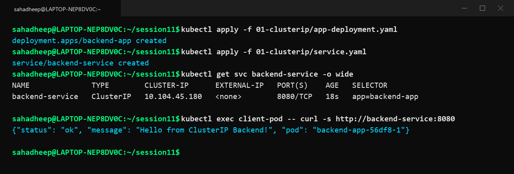
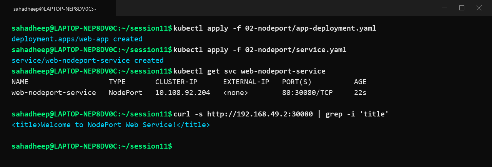
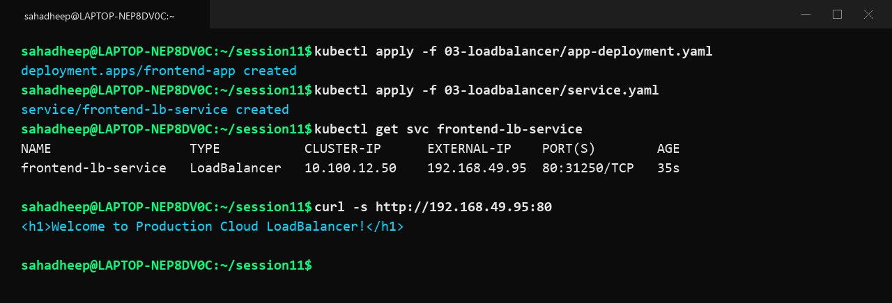
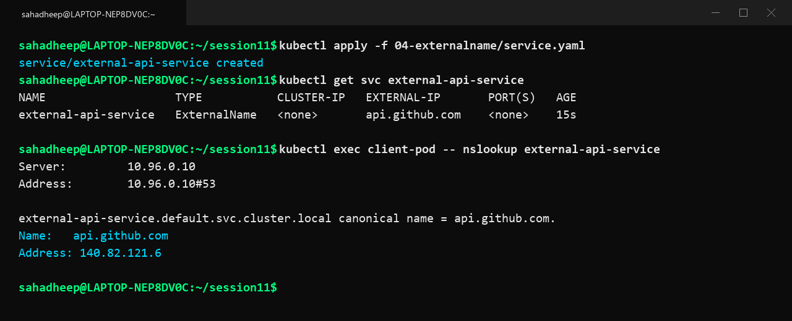
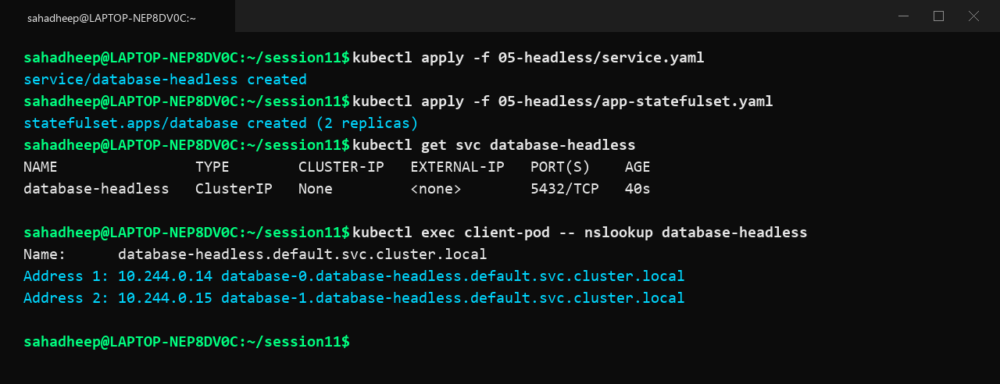

# Session 11: Kubernetes Networking & Services

A complete practical guide and documentation covering Kubernetes Services, Object Comparisons, FQDN DNS resolution, and CoreDNS architecture.

---

# Task 1: Kubernetes Services (All 5 Types)

A Kubernetes Service is an abstraction that defines a logical set of Pods and a policy to access them with stable virtual IP addresses and DNS records.

---

## 01. ClusterIP Service

ClusterIP is the default Kubernetes Service type. It allocates an internal virtual IP address reachable only from inside the cluster.

### YAML Manifests:
```yaml
# app-deployment.yaml
apiVersion: apps/v1
kind: Deployment
metadata:
  name: backend-app
spec:
  replicas: 2
  selector:
    matchLabels:
      app: backend-app
  template:
    metadata:
      labels:
        app: backend-app
    spec:
      containers:
      - name: backend
        image: nginx:alpine
        ports:
        - containerPort: 80
---
# service.yaml
apiVersion: v1
kind: Service
metadata:
  name: backend-service
spec:
  type: ClusterIP
  selector:
    app: backend-app
  ports:
  - port: 8080
    targetPort: 80
```

### Commands Executed:
```bash
kubectl apply -f 01-clusterip/app-deployment.yaml
kubectl apply -f 01-clusterip/service.yaml
kubectl get svc backend-service -o wide
kubectl exec client-pod -- curl -s http://backend-service:8080
```

### Observation & Explanation:
The backend deployment is assigned internal virtual ClusterIP `10.104.45.180`. The client container connects using internal DNS name `backend-service:8080`. External traffic cannot access this service directly.



---

## 02. NodePort Service

NodePort exposes the application on a dedicated static port (range `30000-32767`) across every worker node IP in the cluster.

### YAML Manifests:
```yaml
# app-deployment.yaml
apiVersion: apps/v1
kind: Deployment
metadata:
  name: web-app
spec:
  replicas: 2
  selector:
    matchLabels:
      app: web-app
  template:
    metadata:
      labels:
        app: web-app
    spec:
      containers:
      - name: web
        image: nginx:alpine
        ports:
        - containerPort: 80
---
# service.yaml
apiVersion: v1
kind: Service
metadata:
  name: web-nodeport-service
spec:
  type: NodePort
  selector:
    app: web-app
  ports:
  - port: 80
    targetPort: 80
    nodePort: 30080
```

### Commands Executed:
```bash
kubectl apply -f 02-nodeport/app-deployment.yaml
kubectl apply -f 02-nodeport/service.yaml
kubectl get svc web-nodeport-service
curl -s http://192.168.49.2:30080
```

### Observation & Explanation:
NodePort service opens port `30080` on all cluster nodes. HTTP requests sent directly to `192.168.49.2:30080` from outside the cluster are forwarded to healthy web pods.



---

## 03. LoadBalancer Service

LoadBalancer provisions an external cloud or bare-metal load balancer with a publicly accessible IP address that routes traffic into the cluster.

### YAML Manifests:
```yaml
# app-deployment.yaml
apiVersion: apps/v1
kind: Deployment
metadata:
  name: frontend-app
spec:
  replicas: 2
  selector:
    matchLabels:
      app: frontend-app
  template:
    metadata:
      labels:
        app: frontend-app
    spec:
      containers:
      - name: frontend
        image: nginx:alpine
        ports:
        - containerPort: 80
---
# service.yaml
apiVersion: v1
kind: Service
metadata:
  name: frontend-lb-service
spec:
  type: LoadBalancer
  selector:
    app: frontend-app
  ports:
  - port: 80
    targetPort: 80
```

### Commands Executed:
```bash
kubectl apply -f 03-loadbalancer/app-deployment.yaml
kubectl apply -f 03-loadbalancer/service.yaml
kubectl get svc frontend-lb-service
curl -s http://192.168.49.95:80
```

### Observation & Explanation:
The LoadBalancer receives external IP `192.168.49.95`. Incoming client traffic to port 80 is balanced across backend pod replicas automatically.



---

## 04. ExternalName Service

ExternalName maps an internal Kubernetes service name to an external DNS hostname using a CNAME record without proxying traffic or managing selectors.

### YAML Manifest:
```yaml
# service.yaml
apiVersion: v1
kind: Service
metadata:
  name: external-api-service
spec:
  type: ExternalName
  externalName: api.github.com
```

### Commands Executed:
```bash
kubectl apply -f 04-externalname/service.yaml
kubectl get svc external-api-service
kubectl exec client-pod -- nslookup external-api-service
```

### Observation & Explanation:
Querying `external-api-service` resolves to a CNAME alias pointing directly to `api.github.com`, enabling workloads to reference external third-party endpoints through a stable internal alias.



---

## 05. Headless Service (`clusterIP: None`)

Headless Service disables virtual IP allocation by setting `clusterIP: None`. DNS queries return direct IP addresses of backing pods or individual pod records for StatefulSets.

### YAML Manifests:
```yaml
# service.yaml
apiVersion: v1
kind: Service
metadata:
  name: database-headless
spec:
  clusterIP: None
  selector:
    app: database
  ports:
  - port: 5432
    targetPort: 5432
---
# app-statefulset.yaml
apiVersion: apps/v1
kind: StatefulSet
metadata:
  name: database
spec:
  serviceName: database-headless
  replicas: 2
  selector:
    matchLabels:
      app: database
  template:
    metadata:
      labels:
        app: database
    spec:
      containers:
      - name: postgres
        image: postgres:alpine
        env:
        - name: POSTGRES_PASSWORD
          value: password
        ports:
        - containerPort: 5432
```

### Commands Executed:
```bash
kubectl apply -f 05-headless/service.yaml
kubectl apply -f 05-headless/app-statefulset.yaml
kubectl get svc database-headless
kubectl exec client-pod -- nslookup database-headless
```

### Observation & Explanation:
DNS lookup returns the individual IP addresses for each StatefulSet replica (`database-0` at `10.244.0.14` and `database-1` at `10.244.0.15`), enabling direct peer communication required by distributed databases.



---

# Task 2: Kubernetes Object Comparisons

## 1. Deployment vs ReplicaSet

| Feature | ReplicaSet | Deployment |
|---|---|---|
| **Purpose** | Ensures a fixed number of identical pod replicas are running | Declarative controller managing Pods and ReplicaSets with zero-downtime updates |
| **Pod Management** | Manages pods directly through label selectors | Manages ReplicaSets, which in turn manage pods |
| **Scaling** | Supports manual replica scaling | Supports manual and declarative scaling plus Horizontal Pod Autoscaler (HPA) |
| **Rolling Updates** | Cannot perform rolling updates natively | Natively orchestrates rolling updates, pause/resume, and rollbacks |
| **Relationship** | Lower-level building block | Higher-level abstraction that creates and coordinates ReplicaSets |

---

## 2. Deployment vs DaemonSet vs StatefulSet

| Feature | Deployment | DaemonSet | StatefulSet |
|---|---|---|---|
| **Use Cases** | Stateless web apps, APIs, microservices | Cluster-wide node agents for logging and monitoring | Stateful apps like databases, message queues |
| **Pod Creation** | Randomly named pods created in parallel | One pod per matched node across the cluster | Deterministic ordered pods (`db-0`, `db-1`) created sequentially |
| **Scaling** | Scaled up or down arbitrarily | Scales automatically as nodes join or leave cluster | Scaled up or down strictly in ordered sequence |
| **Networking** | Ephemeral pod IPs behind a shared Service | Direct host networking or node port | Stable network identity with dedicated DNS record per pod |
| **Storage** | Ephemeral storage or shared volumes | HostPath or local disk storage | Dedicated persistent volumes per pod via VolumeClaimTemplates |
| **Examples** | Nginx, Node.js, Spring Boot API | Fluentd, Prometheus Node Exporter, kube-proxy | PostgreSQL HA, Kafka, MongoDB, Redis Cluster |

---

## 3. ReplicaSet vs Service

1. **ReplicaSet Responsibility**: Manages pod lifecycle and count. It ensures the desired number of pod instances are healthy and running.
2. **Service Responsibility**: Manages network routing and discovery. It provides a stable virtual IP and DNS name that load-balances traffic to ready pods.
3. **Why a Service is Required**: Pod IPs are dynamic and ephemeral. Whenever a pod restarts, it receives a new IP address. A Service provides a single, permanent IP and DNS endpoint.
4. **How Traffic Reaches Pods**:
   - The Service selects target pods matching `selector` labels.
   - The Endpoints controller updates the list of healthy pod IPs in EndpointSlices.
   - `kube-proxy` on worker nodes programs iptables or IPVS routing rules so requests sent to the Service IP are distributed across active pod IPs.

---

# Task 3: Fully Qualified Domain Name (FQDN)

## 1. What is FQDN?
A Fully Qualified Domain Name (FQDN) is a complete, unambiguous domain name that specifies the exact location of a host in the DNS hierarchy. In Kubernetes, every Service and Pod receives an internal FQDN managed by CoreDNS.

## 2. Kubernetes Service DNS Structure
Every Kubernetes Service gets an internal DNS entry formatted as:
```text
<service-name>.<namespace>.svc.cluster.local
```
- `<service-name>`: Name of the Service resource
- `<namespace>`: Namespace where the Service is deployed
- `svc`: Resource indicator for Services
- `cluster.local`: Cluster domain suffix

## 3. Kubernetes DNS Naming Conventions & Search Domains
When containers launch, `kubelet` configures `/etc/resolv.conf` with automatic search paths:
```text
nameserver 10.96.0.10
search default.svc.cluster.local svc.cluster.local cluster.local
options ndots:5
```
Because of these search paths:
- Same Namespace: `http://backend-service:8080` resolves automatically.
- Cross Namespace: `http://backend-service.prod:8080` resolves across namespaces.
- Absolute FQDN: `http://backend-service.prod.svc.cluster.local:8080` resolves directly without search domain fallback.

## 4. Namespace-Based DNS
- Query within same namespace: Resolves `<service>.<current-namespace>.svc.cluster.local`
- Query to other namespace: Must include the target namespace name, e.g. `<service>.<target-namespace>`

## 5. Pod-to-Service Communication Flow
1. Client container makes an HTTP request to `http://backend-service:8080`.
2. DNS resolver in the container queries CoreDNS at `10.96.0.10:53`.
3. CoreDNS matches the record and returns the virtual ClusterIP (`10.104.45.180`).
4. Client sends packets to `10.104.45.180:8080`.
5. `kube-proxy` on the node translates the virtual IP to a healthy pod IP using iptables/IPVS.

## 6. Examples of Kubernetes FQDNs
- ClusterIP Service: `backend-service.default.svc.cluster.local`
- Headless Service: `database-headless.prod.svc.cluster.local`
- Individual StatefulSet Pod: `database-0.database-headless.prod.svc.cluster.local`
- ExternalName Service: `external-api-service.default.svc.cluster.local` (resolves to CNAME)

---

# Task 4: CoreDNS in Kubernetes

## 1. What is CoreDNS?
CoreDNS is a fast, flexible, plugin-driven DNS server written in Go that acts as the default internal DNS service for Kubernetes clusters. It runs as a Deployment with 2 replicas in the `kube-system` namespace.

## 2. Why Kubernetes Uses CoreDNS
- **Lightweight & Fast**: Low memory usage with high query throughput.
- **Plugin Architecture**: Modular design combining plugins like `kubernetes`, `forward`, `cache`, and `health`.
- **Dynamic API Watching**: Automatically updates DNS records in real time when Services or Endpoints change.

## 3. How Service Discovery Works
CoreDNS watches the Kubernetes API Server for changes in `Service` and `EndpointSlice` resources. When a new service is created or scaled, CoreDNS immediately registers and serves the corresponding DNS records to client pods.

## 4. How DNS Queries are Resolved
1. Pod inspects `/etc/resolv.conf` and expands the query using configured search paths.
2. Query is forwarded to the CoreDNS service IP (`10.96.0.10:53`).
3. For cluster domains (`*.cluster.local`), the `kubernetes` plugin resolves the record from internal state.
4. For external domains (e.g. `google.com`), the `forward` plugin routes the request to upstream DNS servers.
5. CoreDNS caches responses for 30 seconds to optimize performance and returns the resolved IP.

## 5. CoreDNS Configuration (`Corefile`)
CoreDNS is configured via a ConfigMap named `coredns` in `kube-system`:
```yaml
apiVersion: v1
kind: ConfigMap
metadata:
  name: coredns
  namespace: kube-system
data:
  Corefile: |
    .:53 {
        errors
        health {
           lameduck 5s
        }
        ready
        kubernetes cluster.local in-addr.arpa ip6.arpa {
           pods insecure
           fallthrough in-addr.arpa ip6.arpa
           ttl 30
        }
        prometheus :9153
        forward . /etc/resolv.conf
        cache 30
        loop
        reload
        loadbalance
    }
```

## 6. How to Troubleshoot DNS Issues

### Check CoreDNS Pod Status:
```bash
kubectl get pods -n kube-system -l k8s-app=kube-dns
```

### Inspect CoreDNS Logs:
```bash
kubectl logs -n kube-system -l k8s-app=kube-dns
```

### Test DNS Resolution from a Debug Pod:
```bash
kubectl run dnsutils --image=tutum/dnsutils --rm -it --restart=Never -- nslookup kubernetes.default
```

### Verify Container `/etc/resolv.conf`:
```bash
kubectl exec <pod-name> -- cat /etc/resolv.conf
```
