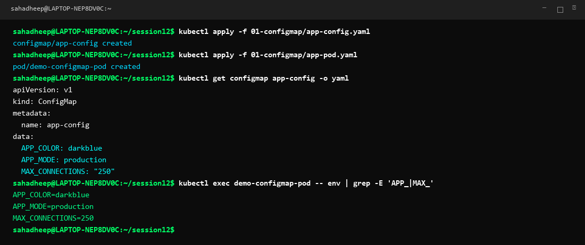
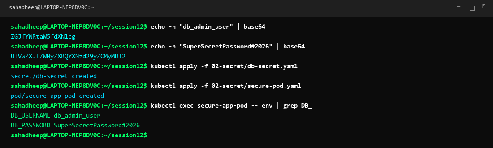
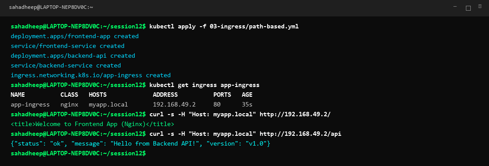
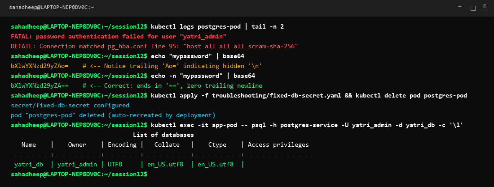

# Session 12: Kubernetes Ingress, ConfigMaps & Secrets

A complete hands-on guide and documentation for Kubernetes configuration management, sensitive credentials handling, Ingress HTTP routing, and real-world troubleshooting.

---

# Task 1: Kubernetes ConfigMaps

A ConfigMap is an API object used to store non-confidential configuration data in key-value pairs. Decoupling configuration artifacts from container image content keeps application containers portable across environments (development, staging, production).

## YAML Manifests

### 1. ConfigMap Definition (`app-config.yaml`):
```yaml
apiVersion: v1
kind: ConfigMap
metadata:
  name: app-config
data:
  APP_COLOR: "darkblue"
  APP_MODE: "production"
  MAX_CONNECTIONS: "250"
```

### 2. Pod Consuming ConfigMap (`app-pod.yaml`):
```yaml
apiVersion: v1
kind: Pod
metadata:
  name: demo-configmap-pod
spec:
  containers:
  - name: web-app
    image: alpine
    command: ["sleep", "3600"]
    envFrom:
    - configMapRef:
        name: app-config
```

## Commands Executed
```bash
kubectl apply -f 01-configmap/app-config.yaml
kubectl apply -f 01-configmap/app-pod.yaml
kubectl get configmap app-config -o yaml
kubectl exec demo-configmap-pod -- env | grep -E 'APP_|MAX_'
```

## Observation & Output
The configuration keys `APP_COLOR`, `APP_MODE`, and `MAX_CONNECTIONS` were populated into the container environment variables without modifying or rebuilding the container image.



---

# Task 2: Kubernetes Secrets

A Kubernetes Secret is an object designed to store confidential information such as passwords, OAuth tokens, and TLS certificates.

## Base64 Encoding
Secret values must be base64-encoded. Always use `echo -n` to prevent unwanted newline characters:
```bash
echo -n "db_admin_user" | base64
# Output: ZGJfYWRtaW5fdXNlcg==

echo -n "SuperSecretPassword#2026" | base64
# Output: U3VwZXJTZWNyZXRQYXNzd29yZCMyMDI2
```

## YAML Manifests

### 1. Secret Definition (`db-secret.yaml`):
```yaml
apiVersion: v1
kind: Secret
metadata:
  name: db-secret
type: Opaque
data:
  DB_USERNAME: ZGJfYWRtaW5fdXNlcg==
  DB_PASSWORD: U3VwZXJTZWNyZXRQYXNzd29yZCMyMDI2
```

### 2. Pod Consuming Secret (`secure-pod.yaml`):
```yaml
apiVersion: v1
kind: Pod
metadata:
  name: secure-app-pod
spec:
  containers:
  - name: app
    image: alpine
    command: ["sleep", "3600"]
    env:
    - name: DB_USERNAME
      valueFrom:
        secretKeyRef:
          name: db-secret
          key: DB_USERNAME
    - name: DB_PASSWORD
      valueFrom:
        secretKeyRef:
          name: db-secret
          key: DB_PASSWORD
```

## Commands Executed
```bash
kubectl apply -f 02-secret/db-secret.yaml
kubectl apply -f 02-secret/secure-pod.yaml
kubectl exec secure-app-pod -- env | grep DB_
```

## Observation & Output
The sensitive database credentials were decoded at runtime by kubelet and securely injected into the container environment.



## Why Secrets Should NEVER Be Committed Directly to Git
1. **Base64 is NOT Encryption**: Base64 is merely an encoding scheme. Anyone who reads the YAML can decode it instantly with `echo "<string>" | base64 -d`.
2. **Git History is Immutable**: Once committed, secrets persist in the commit history even if deleted in a later commit.
3. **Repository Exposure**: Accidental public leaks or unauthorized collaborator access immediately compromises production credentials.
4. **Best Practices in Production**:
   - Use GitOps secret management tools like **Sealed Secrets** or **External Secrets Operator (ESO)**.
   - Integrate with dedicated key vaults such as **HashiCorp Vault**, **AWS Secrets Manager**, or **Azure Key Vault**.
   - Keep unencrypted `.env` and secret manifest files in `.gitignore`.

---

# Task 3: Kubernetes Ingress

Ingress manages external HTTP/HTTPS access to services within a Kubernetes cluster, providing name-based virtual hosting, path-based routing, and SSL/TLS termination.

## YAML Manifests (`path-based.yml`)
```yaml
apiVersion: apps/v1
kind: Deployment
metadata:
  name: frontend-app
spec:
  replicas: 1
  selector:
    matchLabels:
      app: frontend
  template:
    metadata:
      labels:
        app: frontend
    spec:
      containers:
      - name: frontend
        image: nginx:alpine
        ports:
        - containerPort: 80
---
apiVersion: v1
kind: Service
metadata:
  name: frontend-service
spec:
  selector:
    app: frontend
  ports:
  - port: 80
    targetPort: 80
---
apiVersion: apps/v1
kind: Deployment
metadata:
  name: backend-api
spec:
  replicas: 1
  selector:
    matchLabels:
      app: backend
  template:
    metadata:
      labels:
        app: backend
    spec:
      containers:
      - name: backend
        image: hashicorp/http-echo
        args:
        - "-text={\"status\": \"ok\", \"message\": \"Hello from Backend API!\", \"version\": \"v1.0\"}"
        ports:
        - containerPort: 5678
---
apiVersion: v1
kind: Service
metadata:
  name: backend-service
spec:
  selector:
    app: backend
  ports:
  - port: 80
    targetPort: 5678
---
apiVersion: networking.k8s.io/v1
kind: Ingress
metadata:
  name: app-ingress
spec:
  ingressClassName: nginx
  rules:
  - host: myapp.local
    http:
      paths:
      - path: /
        pathType: Prefix
        backend:
          service:
            name: frontend-service
            port:
              number: 80
      - path: /api
        pathType: Prefix
        backend:
          service:
            name: backend-service
            port:
              number: 80
```

## Commands Executed
```bash
kubectl apply -f 03-ingress/path-based.yml
kubectl get ingress app-ingress
curl -s -H "Host: myapp.local" http://192.168.49.2/
curl -s -H "Host: myapp.local" http://192.168.49.2/api
```

## Observation & Output
Traffic sent to `myapp.local/` routed cleanly to the Nginx frontend, while traffic sent to `myapp.local/api` routed directly to the backend API service over a single entrypoint IP.



---

# Task 4: Ingress vs Ingress Controller

## 1. What is Ingress?
Ingress is a standard Kubernetes API resource (`kind: Ingress`) that defines the declarative routing rules (hostnames, URL paths, TLS certificates, backend services). Ingress by itself is only a configuration specification and does not route any traffic.

## 2. What is an Ingress Controller?
An Ingress Controller is a specialized reverse proxy application (such as NGINX Ingress Controller, Traefik, HAProxy, or AWS ALB Ingress Controller) running as a Pod/DaemonSet inside the cluster. It continuously monitors the Kubernetes API server for Ingress resources and configures its proxy routing engine accordingly.

## 3. Comparison Table

| Feature | Ingress | Ingress Controller |
|---|---|---|
| **Definition** | Declarative Kubernetes API rulebook | Active reverse proxy software daemon |
| **Type** | Configuration Object (`kind: Ingress`) | Running Application / Pod / Deployment |
| **Function** | Declares paths, hosts, and destination services | Reads rules, receives network traffic, and routes requests |
| **Traffic Handling** | Never handles network packets directly | Directly receives incoming HTTP/HTTPS connections |
| **Examples** | `ingress.networking.k8s.io/v1` manifest | Ingress-NGINX, Traefik, Kong, HAProxy, AWS ALB Controller |

## 4. Why Both Are Required
- An **Ingress resource without a controller** does nothing. Kubernetes stores the YAML in etcd, but no proxy listens on external ports to route packets.
- An **Ingress Controller without Ingress resources** runs an empty reverse proxy with no backend routing rules configured.
- Together, they separate routing configuration (developer responsibility) from traffic proxy implementation (infrastructure responsibility).

---

# Task 5: Troubleshooting (The Trailing Newline Secret Bug)

## Problem Identification
A PostgreSQL database pod continuously rejected application connection attempts with the error:
`FATAL: password authentication failed for user "yatri_admin"`

The developer reported using `echo "mypassword" | base64` when creating the secret manifest.

## Root Cause Analysis
Standard `echo` appends an invisible trailing newline byte (`\n` / ASCII `0x0A`):
- `echo "mypassword" | base64` produces `bXlwYXNzd29yZAo=`
- Inside the container, the database password received was `mypassword\n` (11 characters) instead of `mypassword` (10 characters), resulting in authentication failure.

## Solution & Fix
Using the `-n` flag removes the trailing newline:
- `echo -n "mypassword" | base64` produces `bXlwYXNzd29yZA==`

```yaml
# troubleshooting/fixed-db-secret.yaml
apiVersion: v1
kind: Secret
metadata:
  name: fixed-db-secret
type: Opaque
data:
  POSTGRES_PASSWORD: bXlwYXNzd29yZA==
```

## Verification
Applying the corrected secret and testing database connectivity:


