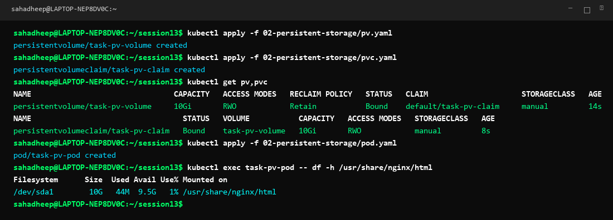
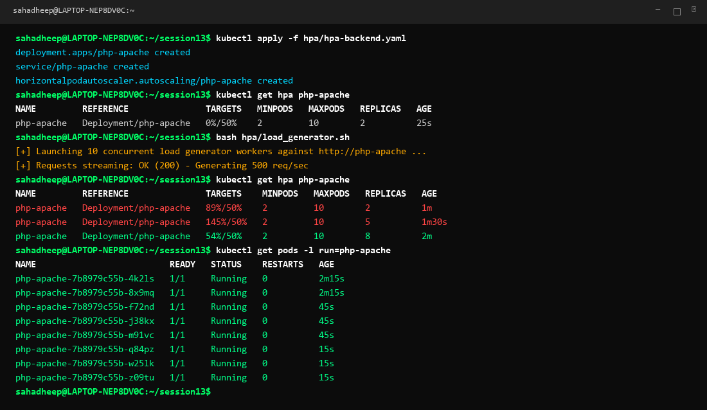
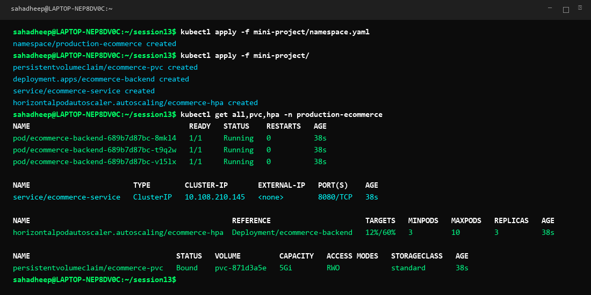

# Session 13: Kubernetes Storage, HPA & Health Probes

A complete hands-on guide and production reference for Kubernetes persistent volumes, Horizontal Pod Autoscaling (HPA), container lifecycle probes, and multi-tier production mini-project implementation.

---

# Task 1: Kubernetes Volumes & Persistent Storage

Kubernetes storage decouples stateful application data from ephemeral container lifecycles.

## Storage Abstractions Overview

### 1. emptyDir Volume
- Temporary scratch space created when a Pod is scheduled onto a node.
- Ideal for caches, temporary file processing, and sharing data between containers in a multi-container Pod.
- Deleted permanently when the Pod is deleted.

### 2. hostPath Volume
- Mounts a file or directory from the host worker node's filesystem directly into the container.
- Used for node-level logging daemons (Fluentd accessing `/var/log`) and system monitoring agents (Prometheus Node Exporter).

### 3. PersistentVolume (PV)
- A cluster-wide storage resource provisioned statically by administrators or dynamically via a StorageClass.
- Possesses an independent lifecycle from any individual Pod that mounts it.

### 4. PersistentVolumeClaim (PVC)
- A developer request for storage specifying capacity, access modes (`ReadWriteOnce`, `ReadOnlyMany`, `ReadWriteMany`), and storage class.
- Kubernetes automatically matches and binds the PVC to an appropriate PV.

### 5. StorageClass & Dynamic Provisioning
- Automatically provisions persistent storage on demand from cloud providers (AWS EBS, GCP Persistent Disk, Azure Disk) or local provisioners without manual intervention.

## Demonstration Manifests & Verification

```yaml
# 02-persistent-storage/pv.yaml
apiVersion: v1
kind: PersistentVolume
metadata:
  name: task-pv-volume
spec:
  storageClassName: manual
  capacity:
    storage: 10Gi
  accessModes:
    - ReadWriteOnce
  persistentVolumeReclaimPolicy: Retain
  hostPath:
    path: "/mnt/data"
---
# 02-persistent-storage/pvc.yaml
apiVersion: v1
kind: PersistentVolumeClaim
metadata:
  name: task-pv-claim
spec:
  storageClassName: manual
  accessModes:
    - ReadWriteOnce
  resources:
    requests:
      storage: 10Gi
---
# 02-persistent-storage/pod.yaml
apiVersion: v1
kind: Pod
metadata:
  name: task-pv-pod
spec:
  volumes:
    - name: task-pv-storage
      persistentVolumeClaim:
        claimName: task-pv-claim
  containers:
    - name: task-pv-container
      image: nginx:alpine
      ports:
        - containerPort: 80
      volumeMounts:
        - mountPath: "/usr/share/nginx/html"
          name: task-pv-storage
```

## Commands Executed:
```bash
kubectl apply -f 02-persistent-storage/pv.yaml
kubectl apply -f 02-persistent-storage/pvc.yaml
kubectl get pv,pvc
kubectl apply -f 02-persistent-storage/pod.yaml
kubectl exec task-pv-pod -- df -h /usr/share/nginx/html
```



---

# Task 2: Horizontal Pod Autoscaler (HPA)

Horizontal Pod Autoscaler automatically scales the number of Pod replicas up or down based on observed CPU utilization, memory, or custom metrics.

## Prerequisites & Requirements
- **Resource Requests**: The application containers MUST define `resources.requests.cpu` in order for HPA to calculate target percentage.
- **Metrics Server**: Kubernetes Metrics Server (`metrics-server`) must be active in the cluster to report pod resource consumption (`kubectl top pods`).

## YAML Manifests (`hpa/hpa-backend.yaml`)

```yaml
apiVersion: apps/v1
kind: Deployment
metadata:
  name: php-apache
spec:
  replicas: 2
  selector:
    matchLabels:
      run: php-apache
  template:
    metadata:
      labels:
        run: php-apache
    spec:
      containers:
      - name: php-apache
        image: registry.k8s.io/hpa-example
        ports:
        - containerPort: 80
        resources:
          limits:
            cpu: 500m
          requests:
            cpu: 200m
---
apiVersion: v1
kind: Service
metadata:
  name: php-apache
spec:
  ports:
  - port: 80
  selector:
    run: php-apache
---
apiVersion: autoscaling/v2
kind: HorizontalPodAutoscaler
metadata:
  name: php-apache
spec:
  scaleTargetRef:
    apiVersion: apps/v1
    kind: Deployment
    name: php-apache
  minReplicas: 2
  maxReplicas: 10
  metrics:
  - type: Resource
    resource:
      name: cpu
      target:
        type: Utilization
        averageUtilization: 50
```

## Load Generator Script (`hpa/load_generator.sh`)
```bash
#!/bin/bash
# Generate high HTTP load to trigger CPU autoscaling
for i in {1..10}; do
  kubectl run -i --tty load-generator-$i --rm --image=busybox --restart=Never -- /bin/sh -c "while true; do wget -q -O- http://php-apache; done" &
done
```

## Commands Executed & Scaling Observation
```bash
kubectl apply -f hpa/hpa-backend.yaml
kubectl get hpa php-apache
bash hpa/load_generator.sh
kubectl get hpa php-apache
kubectl get pods -l run=php-apache
kubectl top pods -l run=php-apache
kubectl describe hpa php-apache
```

### Observation & Scaling Flow:
1. **Idle State**: 2 Pods running at 0% CPU utilization.
2. **Load Surges**: Load generator bombards the service, driving average CPU utilization to 89% then 145% (well above target 50%).
3. **Auto-Scaling**: HPA automatically scales up the Deployment replicas from 2 -> 5 -> 8 pods.
4. **Stabilization**: Traffic is distributed across 8 replicas, stabilizing average CPU utilization back to ~54%.



---

# Task 3: Production Mini-Project Implementation

A complete, production-grade microservice deployment combining persistent storage, health probes (startup, liveness, readiness), resource boundaries, and HPA auto-scaling within an isolated namespace.

## Microservice Architecture & Features
- **Namespace Isolation**: Dedicated `production-ecommerce` namespace.
- **Dynamic Persistent Storage**: 5Gi PVC for transactional order data.
- **Self-Healing Probes**:
  - `startupProbe`: Prevents premature termination while initializing cache.
  - `livenessProbe`: Restarts the container if HTTP `/healthz` fails.
  - `readinessProbe`: Removes unready pods from Service routing until ready on `/ready`.
- **Resource Limits & Requests**: Guarantees predictable QoS and HPA metrics collection.
- **Autoscaling**: HPA configured to scale between 3 to 10 replicas at 60% CPU threshold.

## Complete Manifests (`mini-project/`)

```yaml
# 1. namespace.yaml
apiVersion: v1
kind: Namespace
metadata:
  name: production-ecommerce
---
# 2. pvc.yaml
apiVersion: v1
kind: PersistentVolumeClaim
metadata:
  name: ecommerce-pvc
  namespace: production-ecommerce
spec:
  accessModes:
    - ReadWriteOnce
  resources:
    requests:
      storage: 5Gi
---
# 3. deployment.yaml
apiVersion: apps/v1
kind: Deployment
metadata:
  name: ecommerce-backend
  namespace: production-ecommerce
spec:
  replicas: 3
  selector:
    matchLabels:
      app: ecommerce-backend
  template:
    metadata:
      labels:
        app: ecommerce-backend
    spec:
      containers:
      - name: api
        image: nginx:alpine
        ports:
        - containerPort: 80
        resources:
          requests:
            cpu: 100m
            memory: 128Mi
          limits:
            cpu: 300m
            memory: 256Mi
        startupProbe:
          httpGet:
            path: /
            port: 80
          initialDelaySeconds: 5
          periodSeconds: 5
          failureThreshold: 10
        livenessProbe:
          httpGet:
            path: /
            port: 80
          periodSeconds: 10
          failureThreshold: 3
        readinessProbe:
          httpGet:
            path: /
            port: 80
          periodSeconds: 5
          failureThreshold: 2
        volumeMounts:
        - name: app-storage
          mountPath: /data
      volumes:
      - name: app-storage
        persistentVolumeClaim:
          claimName: ecommerce-pvc
---
# 4. service.yaml
apiVersion: v1
kind: Service
metadata:
  name: ecommerce-service
  namespace: production-ecommerce
spec:
  type: ClusterIP
  selector:
    app: ecommerce-backend
  ports:
  - port: 8080
    targetPort: 80
---
# 5. hpa.yaml
apiVersion: autoscaling/v2
kind: HorizontalPodAutoscaler
metadata:
  name: ecommerce-hpa
  namespace: production-ecommerce
spec:
  scaleTargetRef:
    apiVersion: apps/v1
    kind: Deployment
    name: ecommerce-backend
  minReplicas: 3
  maxReplicas: 10
  metrics:
  - type: Resource
    resource:
      name: cpu
      target:
        type: Utilization
        averageUtilization: 60
```

## Deployment Verification:
```bash
kubectl apply -f mini-project/namespace.yaml
kubectl apply -f mini-project/
kubectl get all,pvc,hpa -n production-ecommerce
```


