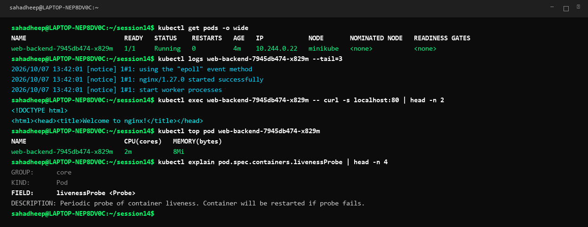
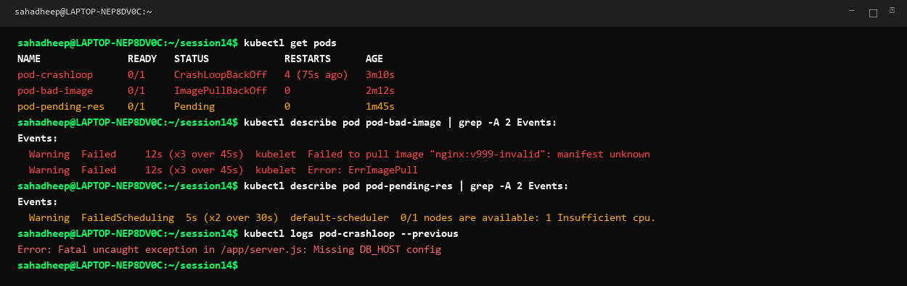
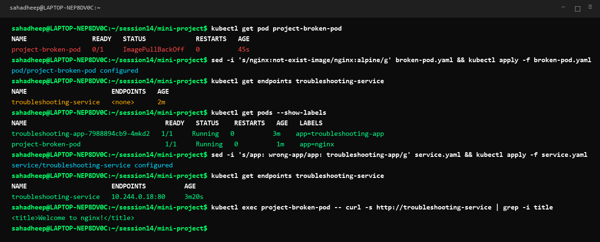

# Session 14: Kubernetes Troubleshooting

A complete practical troubleshooting playbook for diagnosing and resolving Kubernetes cluster, pod, service, networking, and configuration failures.

---

# Task 1: Essential Kubernetes Troubleshooting Commands

When troubleshooting any Kubernetes workload, follow the systematic diagnosis sequence:

```text
GET  ──►  DESCRIBE  ──►  EVENTS  ──►  LOGS  ──►  EXEC  ──►  TOP  ──►  EXPLAIN
```

## 1. `kubectl get` and `kubectl get -o wide`
- **Purpose**: Quick snapshot of cluster resource health and status.
- **`-o wide` Output**: Reveals internal Pod IPs, assigned worker nodes, readiness gates, and restart counts.
```bash
kubectl get pods -o wide
kubectl get nodes -o wide
kubectl get svc,ep -o wide
```

## 2. `kubectl describe`
- **Purpose**: Deep inspection of resource state, lifecycle conditions, volume mounts, and warning events.
```bash
kubectl describe pod <pod-name>
kubectl describe node <node-name>
kubectl describe service <service-name>
```

## 3. `kubectl logs`
- **Purpose**: Reads container standard output (`stdout`) and standard error (`stderr`) streams.
- **`--previous` Flag**: Crucial for CrashLoopBackOff to read logs from the container instance right before it crashed.
```bash
kubectl logs <pod-name> -c <container-name> --tail=50
kubectl logs <pod-name> --previous
```

## 4. `kubectl exec`
- **Purpose**: Spawns an interactive shell inside a running container to verify local processes, disk state, and internal network reachability.
```bash
kubectl exec -it <pod-name> -- /bin/sh
kubectl exec <pod-name> -- curl -s http://localhost:80
```

## 5. `kubectl get events`
- **Purpose**: Chronological timeline of cluster-wide events and warning messages.
```bash
kubectl get events --sort-by='.metadata.creationTimestamp'
```

## 6. `kubectl top`
- **Purpose**: Real-time CPU and memory resource consumption metrics reported by the Metrics Server.
```bash
kubectl top nodes
kubectl top pods --all-namespaces
```

## 7. `kubectl explain`
- **Purpose**: Built-in interactive documentation for any Kubernetes API resource schema and fields.
```bash
kubectl explain pod.spec.containers.livenessProbe
kubectl explain service.spec
```



---

# Task 2: Troubleshooting Common Kubernetes Issues

## 1. CrashLoopBackOff
- **Symptom**: Pod starts, crashes immediately, and enters an exponential backoff restart delay.
- **Root Causes**: Application runtime exception, unhandled error, missing environment variable, incorrect startup command, or failed database connection.
- **Investigation**: Run `kubectl logs <pod-name> --previous` and `kubectl describe pod <pod-name>`.
- **Fix**: Correct the runtime exception, supply missing configuration keys, or fix entrypoint scripts.

## 2. ImagePullBackOff & ErrImagePull
- **Symptom**: Container cannot pull container image from registry.
- **Root Causes**: Typo in image name or tag, non-existent repository, private image without `imagePullSecrets`, or registry rate limit.
- **Investigation**: Run `kubectl describe pod <pod-name>` and check the `Events:` section.
- **Fix**: Fix image tag syntax, verify registry availability, or create docker-registry secret credentials.

## 3. Pending Pod
- **Symptom**: Pod remains in `Pending` state and is never scheduled onto a worker node.
- **Root Causes**: Insufficient CPU/Memory capacity on cluster nodes (`Insufficient cpu`), unsatisfied `nodeSelector`/node affinity, node taints without matching tolerations, or unbound PVC.
- **Investigation**: Run `kubectl describe pod <pod-name>` and check `Warning FailedScheduling`.
- **Fix**: Reduce container resource requests, scale up cluster node pool, or bind the required PVC.

## 4. ContainerCreating
- **Symptom**: Pod is stuck in `ContainerCreating` for extended duration.
- **Root Causes**: Waiting for Persistent Volume disk attachment from cloud provider, CNI network interface creation lag, or missing ConfigMap/Secret marked as required.
- **Investigation**: Run `kubectl describe pod <pod-name>` -> inspect `FailedMount` or `FailedAttachVolume` events.
- **Fix**: Resolve volume mount conflicts or ensure referenced ConfigMaps and Secrets exist.

## 5. Service Connectivity Issues
- **Symptom**: Service IP or DNS is unreachable or returns connection refused / timeout.
- **Root Causes**: Service label selector does not match Pod labels (`Endpoints: <none>`), `targetPort` does not match the actual listening container port, or pods are not in `Ready` state.
- **Investigation**: Run `kubectl get endpoints <service-name>` and `kubectl describe service <service-name>`.
- **Fix**: Match `spec.selector` in Service YAML with `spec.template.metadata.labels` of the Deployment.

## 6. DNS Resolution Issues
- **Symptom**: Pods fail to resolve `<service>.<namespace>.svc.cluster.local`.
- **Root Causes**: CoreDNS deployment pods crashing, upstream DNS forwarder failure, or `ndots:5` search domain traversal issues.
- **Investigation**: Run `kubectl get pods -n kube-system -l k8s-app=kube-dns` and `kubectl logs -n kube-system -l k8s-app=kube-dns`.
- **Fix**: Restart CoreDNS deployment, repair Corefile ConfigMap, or fix network policies blocking port 53 UDP.



---

# Task 3: Troubleshooting Mini-Project Challenge

## Scenario Overview
A production Nginx web service was reported broken by the team. Both the pod deployment and service routing were failing.

---

## Issue 1: Broken Pod (`project-broken-pod`)

### Problem Statement:
Pod `project-broken-pod` failed to start and was stuck in `ImagePullBackOff`.

### Investigation Steps:
```bash
kubectl get pod project-broken-pod
kubectl describe pod project-broken-pod
```

### Root Cause:
The pod manifest referenced a non-existent image repository `nginx:not-exist-image`. Kubelet logged `Failed to pull image: manifest unknown`.

### Solution & Fix:
Updated `broken-pod.yaml` image reference to valid image `nginx:alpine`:
```yaml
apiVersion: v1
kind: Pod
metadata:
  name: project-broken-pod
  labels:
    app: nginx
spec:
  containers:
  - name: nginx-container
    image: nginx:alpine
```
Applied the fix: `kubectl apply -f broken-pod.yaml`. Verified status changed to `Running (1/1)`.

---

## Issue 2: Service Traffic Routing Failure (`troubleshooting-service`)

### Problem Statement:
Requests to `http://troubleshooting-service` timed out and failed to reach active pods.

### Investigation Steps:
```bash
kubectl get endpoints troubleshooting-service
# Output showed: <none>

kubectl get pods --show-labels
kubectl describe service troubleshooting-service
```

### Root Cause:
Label selector mismatch:
- **Service Selector**: `app: wrong-app`
- **Pod Labels**: `app: troubleshooting-app`
Because no pods matched `app: wrong-app`, the Service had zero endpoints registered.

### Solution & Fix:
Corrected `service.yaml` selector to match the running deployment labels:
```yaml
apiVersion: v1
kind: Service
metadata:
  name: troubleshooting-service
spec:
  selector:
    app: troubleshooting-app
  ports:
  - port: 80
    targetPort: 80
```
Applied fix: `kubectl apply -f service.yaml`. Verified `kubectl get endpoints troubleshooting-service` immediately populated with Pod IP `10.244.0.18:80`. Tested connectivity via curl and received HTTP 200 OK.

---

## Troubleshooting Summary Table

| Problem | Symptom Observed | Diagnostic Command Used | Root Cause | Solution / Fix |
|---|---|---|---|---|
| **Broken Pod** | `ImagePullBackOff` | `kubectl describe pod project-broken-pod` | Image tag `nginx:not-exist-image` does not exist | Changed image to `nginx:alpine` and reapplied YAML |
| **Service Failure** | Service Endpoints `<none>` | `kubectl get endpoints troubleshooting-service` | Selector mismatch (`app: wrong-app` vs `app: troubleshooting-app`) | Updated Service selector to `app: troubleshooting-app` |
| **Connectivity** | Connection Refused / Timeout | `kubectl exec -it <pod> -- curl -s <service>` | Service had zero healthy endpoints | Fixed selector; verified endpoints and successful curl response |

