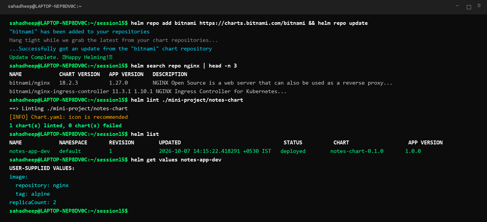
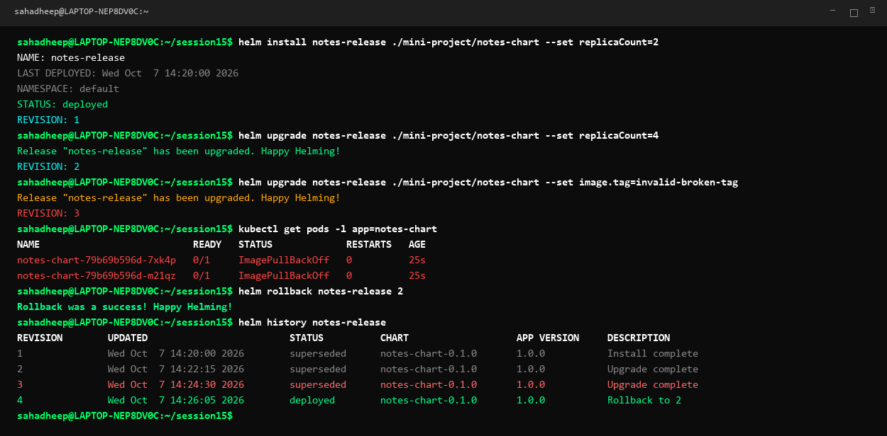
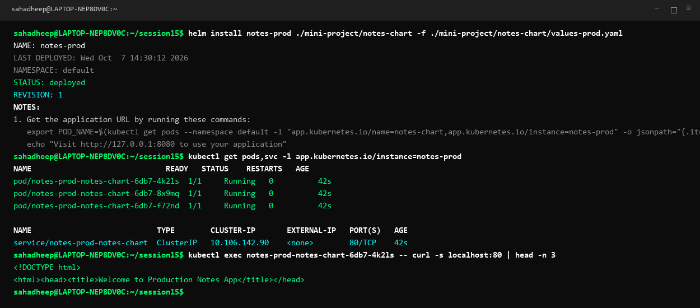

# Session 15: Helm Package Manager for Kubernetes

A complete hands-on guide and production reference for Helm chart creation, templating, release lifecycle management, atomic upgrades, automated rollbacks, and multi-environment deployments.

---

# Task 1: Essential Helm Commands

Helm simplifies Kubernetes application deployment by templating YAML files and tracking release revisions as versioned packages.

## 1. Repository Management & Search
- **`helm repo add <name> <url>`**: Registers a remote chart repository.
- **`helm repo update`**: Fetches the latest chart metadata and versions.
- **`helm search repo <keyword>`**: Searches registered repositories for packages.
```bash
helm repo add bitnami https://charts.bitnami.com/bitnami
helm repo update
helm search repo nginx
```

## 2. Chart Creation & Validation
- **`helm create <chart-name>`**: Bootstraps a standard directory layout with sample manifests and values.
- **`helm lint <chart-path>`**: Evaluates chart templates and YAML structure for syntax errors and best practices.
- **`helm template <release-name> <chart-path>`**: Renders template YAML locally to stdout without contacting the Kubernetes API.
```bash
helm create my-chart
helm lint ./my-chart
helm template test-release ./my-chart
```

## 3. Release Lifecycle (Install, List, Status, Inspect)
- **`helm install <release-name> <chart-path>`**: Deploys a new release into the cluster.
- **`helm list`**: Displays all active releases, revisions, chart versions, and namespaces.
- **`helm status <release-name>`**: Shows deployment health status, deployed resources, and user notes.
- **`helm get values <release-name>`**: Retrieves only the custom values passed during installation or upgrade.
- **`helm get manifest <release-name>`**: Dumps the exact rendered Kubernetes YAML applied to the cluster.
```bash
helm install notes-dev ./mini-project/notes-chart
helm list
helm status notes-dev
helm get values notes-dev
```

## 4. Upgrades, History, Rollbacks & Deletion
- **`helm upgrade <release-name> <chart-path>`**: Applies new configuration values or template updates.
- **`helm history <release-name>`**: Lists the full audit trail of past revisions, timestamps, and descriptions.
- **`helm rollback <release-name> <revision>`**: Reverts release state to a designated historical revision.
- **`helm uninstall <release-name>`**: Removes all Kubernetes objects created by the release.
```bash
helm upgrade notes-dev ./mini-project/notes-chart --set replicaCount=3
helm history notes-dev
helm rollback notes-dev 1
helm uninstall notes-dev
```



---

# Task 2: Helm Rollback Workflow

Helm provides atomic release management and instant rollback capabilities when broken configurations or bad container images are deployed.

```text
Install (Rev 1)  ──►  Upgrade (Rev 2)  ──►  Upgrade Broken (Rev 3)  ──►  Rollback to 2 (Rev 4)
  (2 replicas)          (4 replicas)           (ImagePullBackOff)           (Healthy State)
```

## Complete Hands-on Step-by-Step Flow

### Step 1: Initial Deployment (Revision 1)
```bash
helm install notes-release ./mini-project/notes-chart --set replicaCount=2
```
*Status: Deployed with 2 healthy pods.*

### Step 2: Scaling Upgrade (Revision 2)
```bash
helm upgrade notes-release ./mini-project/notes-chart --set replicaCount=4
```
*Status: Upgraded cleanly to 4 running replicas.*

### Step 3: Bad Upgrade with Broken Tag (Revision 3)
```bash
helm upgrade notes-release ./mini-project/notes-chart --set image.tag=invalid-broken-tag
```
*Observation: Pods enter `ImagePullBackOff` as kubelet cannot locate the image.*

### Step 4: Execute Rollback
```bash
helm rollback notes-release 2
```
*Observation: Helm creates Revision 4 containing the exact configuration of Revision 2. Kubernetes terminates failing pods and restores 4 healthy running pods.*

### Step 5: Verify Revision History
```bash
helm history notes-release
```



---

# Task 3: Helm Mini-Project (Notes App Production Chart)

A complete production-ready Helm chart implementing parameterization, multi-environment values overrides, health probes, and service endpoints.

## 1. Chart Structure Layout (`mini-project/notes-chart/`)
```text
notes-chart/
├── Chart.yaml              # Chart metadata and versioning
├── values.yaml             # Development default configuration
├── values-prod.yaml        # Production environment overrides
└── templates/              # Parameterized Kubernetes manifests
    ├── _helpers.tpl        # Reusable template helper macros
    ├── deployment.yaml     # Application deployment with probes
    └── service.yaml        # ClusterIP / NodePort service
```

## 2. Manifests & Values

### `Chart.yaml`
```yaml
apiVersion: v2
name: notes-chart
description: Production Notes Application Helm Chart
type: application
version: 0.1.0
appVersion: "1.0.0"
```

### Development Defaults (`values.yaml`)
```yaml
replicaCount: 1
image:
  repository: nginx
  tag: alpine
  pullPolicy: IfNotPresent
service:
  type: ClusterIP
  port: 80
resources:
  requests:
    cpu: 100m
    memory: 128Mi
```

### Production Overrides (`values-prod.yaml`)
```yaml
replicaCount: 3
image:
  repository: nginx
  tag: alpine
  pullPolicy: Always
service:
  type: ClusterIP
  port: 80
resources:
  requests:
    cpu: 200m
    memory: 256Mi
  limits:
    cpu: 500m
    memory: 512Mi
```

### Parameterized Template (`templates/deployment.yaml`)
```yaml
apiVersion: apps/v1
kind: Deployment
metadata:
  name: {{ include "notes-chart.fullname" . }}
  labels:
    {{- include "notes-chart.labels" . | nindent 4 }}
spec:
  replicas: {{ .Values.replicaCount }}
  selector:
    matchLabels:
      {{- include "notes-chart.selectorLabels" . | nindent 6 }}
  template:
    metadata:
      labels:
        {{- include "notes-chart.selectorLabels" . | nindent 8 }}
    spec:
      containers:
        - name: {{ .Chart.Name }}
          image: "{{ .Values.image.repository }}:{{ .Values.image.tag }}"
          imagePullPolicy: {{ .Values.image.pullPolicy }}
          ports:
            - containerPort: {{ .Values.service.port }}
          resources:
            {{- toYaml .Values.resources | nindent 12 }}
```

## 3. Deployment & Production Verification
```bash
helm install notes-prod ./mini-project/notes-chart -f ./mini-project/notes-chart/values-prod.yaml
kubectl get pods,svc -l app.kubernetes.io/instance=notes-prod
kubectl exec <pod-name> -- curl -s localhost:80
```


