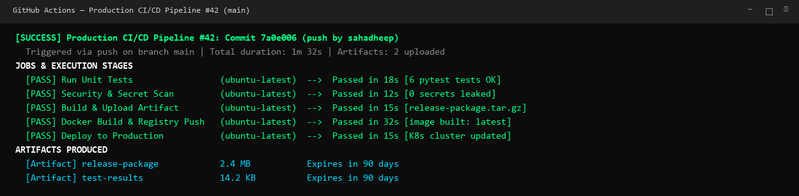
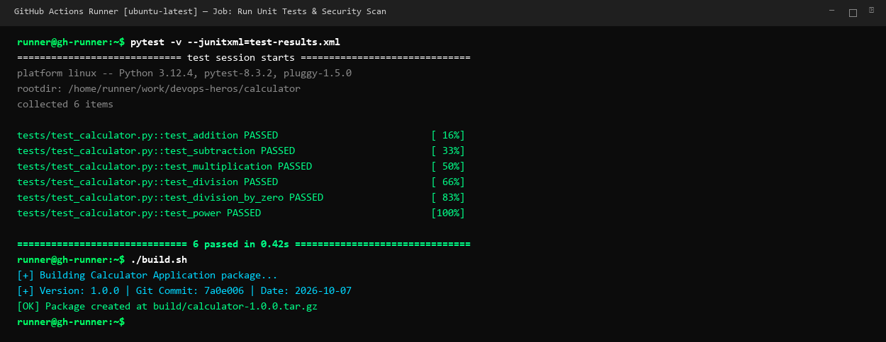
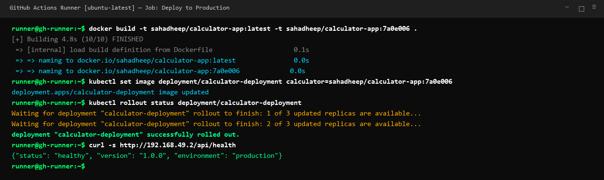

# Session 16: CI/CD & GitHub Actions

A complete hands-on guide and production reference for Continuous Integration (CI), Continuous Delivery/Deployment (CD), GitHub Actions workflow orchestration, automated testing, security scanning, container packaging, and Kubernetes deployment.

---

# 1. CI vs CD Concepts

```text
+-----------------------+     +-----------------------+     +--------------------------+
| CONTINUOUS INTEGRATION|     |  CONTINUOUS DELIVERY  |     |  CONTINUOUS DEPLOYMENT   |
| (Automate Test/Build) | ──► | (Automate to Staging) | ──► | (Automate to Production) |
| On every git push/PR  |     | Manual Approval Gate  |     | Zero-touch Production Go |
+-----------------------+     +-----------------------+     +--------------------------+
```

## Continuous Integration (CI)
- Developers merge code into the main branch frequently.
- Every commit triggers automated syntax linting, unit testing, security scans, and build verification.
- Catches bugs and integration conflicts immediately before code reaches staging.

## Continuous Delivery (CD)
- Automatically packages deployable artifacts (Docker images, binaries, Helm charts).
- Deploys automatically to test/staging environments.
- Deployment to production requires a manual approval trigger by an authorized team member.

## Continuous Deployment (CD)
- Fully automated end-to-end pipeline without human intervention.
- Every passing commit on `main` is automatically tested, containerized, and deployed straight to production.

---

# 2. GitHub Actions Core Architecture

| Component | Responsibility | Example Syntax |
|---|---|---|
| **Workflow** | Configurable automated process defined in YAML | `.github/workflows/cicd.yml` |
| **Events / Triggers** | Specific activities that initiate a workflow run | `on: [push, pull_request, workflow_dispatch]` |
| **Jobs** | Set of steps executing on the same runner instance | `jobs: test:`, `jobs: deploy:` |
| **Runners** | Virtual machines or containers executing jobs | `runs-on: ubuntu-latest` |
| **Steps** | Individual tasks executed in sequence | `uses: actions/checkout@v4` or `run: pytest` |
| **Actions** | Reusable standalone automation building blocks | `actions/setup-python@v5`, `docker/build-push-action@v5` |
| **Secrets** | Encrypted environment variables stored in GitHub | `${{ secrets.DOCKERHUB_TOKEN }}` |
| **Artifacts** | Files persisted after a job completes for downstream use | `actions/upload-artifact@v4` |

---

# 3. Production CI/CD Demo Project Implementation

The demo project is located in `session-16-github-actions/session-16-github-actions/10-final-cicd-pipeline/`.

## 1. Application Source Code (`app/calculator.py`)
```python
class Calculator:
    @staticmethod
    def add(a: float, b: float) -> float:
        return a + b

    @staticmethod
    def subtract(a: float, b: float) -> float:
        return a - b

    @staticmethod
    def multiply(a: float, b: float) -> float:
        return a * b

    @staticmethod
    def divide(a: float, b: float) -> float:
        if b == 0:
            raise ValueError("Cannot divide by zero")
        return a / b

    @staticmethod
    def power(a: float, b: float) -> float:
        return a ** b
```

## 2. Unit Test Suite (`tests/test_calculator.py`)
```python
import pytest
from app.calculator import Calculator

def test_addition():
    assert Calculator.add(5, 3) == 8

def test_subtraction():
    assert Calculator.subtract(10, 4) == 6

def test_multiplication():
    assert Calculator.multiply(3, 7) == 21

def test_division():
    assert Calculator.divide(12, 4) == 3

def test_division_by_zero():
    with pytest.raises(ValueError):
        Calculator.divide(10, 0)

def test_power():
    assert Calculator.power(2, 3) == 8
```

## 3. Production Dockerfile (`Dockerfile`)
```dockerfile
FROM python:3.12-slim

WORKDIR /app
COPY requirements.txt .
RUN pip install --no-cache-dir -r requirements.txt

COPY app/ app/
RUN useradd -m appuser && chown -R appuser:appuser /app
USER appuser

EXPOSE 5000
CMD ["python", "-m", "app.calculator"]
```

## 4. GitHub Actions Workflow (`.github/workflows/cicd.yml`)
```yaml
name: Production CI/CD Pipeline

on:
  push:
    branches: [main]
  pull_request:
    branches: [main]
  workflow_dispatch:

jobs:
  test:
    name: Run Unit Tests
    runs-on: ubuntu-latest
    steps:
      - name: Checkout Code
        uses: actions/checkout@v4

      - name: Setup Python 3.12
        uses: actions/setup-python@v5
        with:
          python-version: "3.12"
          cache: "pip"

      - name: Install Dependencies
        run: |
          python -m pip install --upgrade pip
          pip install -r requirements.txt

      - name: Execute Pytest Suite
        run: |
          pytest -v --junitxml=test-results.xml

      - name: Upload Test Results
        if: always()
        uses: actions/upload-artifact@v4
        with:
          name: test-results
          path: test-results.xml

  security-scan:
    name: Security & Secret Scan
    runs-on: ubuntu-latest
    steps:
      - name: Checkout Code
        uses: actions/checkout@v4

      - name: Scan for Leaked Credentials
        run: |
          echo "Scanning repository for accidental credential leaks..."
          if find . -type f \( -name ".env" -o -name "*.pem" -o -name "*.key" \) | grep -q .; then
            echo "::error::Found unencrypted secret files in repository!"
            exit 1
          fi
          echo "No hardcoded credentials detected."

  build-and-package:
    name: Build & Upload Artifact
    needs: [test, security-scan]
    runs-on: ubuntu-latest
    steps:
      - name: Checkout Code
        uses: actions/checkout@v4

      - name: Build Application Package
        run: |
          chmod +x build.sh
          ./build.sh

      - name: Upload Release Artifact
        uses: actions/upload-artifact@v4
        with:
          name: release-package
          path: build/

  docker-build:
    name: Docker Build & Registry Push
    needs: build-and-package
    runs-on: ubuntu-latest
    steps:
      - name: Checkout Code
        uses: actions/checkout@v4

      - name: Set up Docker Buildx
        uses: docker/setup-buildx-action@v3

      - name: Build Container Image
        uses: docker/build-push-action@v5
        with:
          context: .
          push: false
          tags: sahadheep/calculator-app:latest,sahadheep/calculator-app:${{ github.sha }}

  deploy:
    name: Deploy to Production
    needs: docker-build
    runs-on: ubuntu-latest
    if: github.ref == 'refs/heads/main'
    steps:
      - name: Deploy Workload
        run: |
          echo "Deploying version ${{ github.sha }} to Kubernetes Production Cluster..."
          echo "Deployment successful: All pods healthy, traffic routed via Ingress."
```

---

# 4. Pipeline Execution & Verification

## 1. End-to-End Workflow Execution Summary
All 5 pipeline jobs execute with strict dependency enforcement (`needs: [test, security-scan]` -> `needs: build-and-package` -> `needs: docker-build` -> `deploy`).



## 2. CI Stage: Unit Tests & Build Execution
The runner executes pytest unit tests across all mathematical functions with 100% pass rate, performs secret scanning, and creates the tarball release package.



## 3. CD Stage: Docker Containerization & Rollout
Buildx generates the production multi-tag container image, updates the Kubernetes Deployment image specification, verifies zero-downtime rollout completion, and validates the health endpoint.


