# Session 10: Kubernetes Pods, ReplicaSets & Deployments

## Resources
- https://github.com/Nency-Ravaliya/Kubernetes
- https://github.com/Nency-Ravaliya/Kubernetes/blob/main/core-objects.md

---

# Task 1: Deployment Strategies

## 01. Rolling Update
Rolling Update replaces old pods with new ones gradually with zero downtime. Kubernetes spins up a new pod, waits for it to become healthy, and then terminates an old pod until all replicas are updated.

### Commands Used:
```bash
kubectl apply -f 01-rolling-update/deployment-v1.yaml
kubectl apply -f 01-rolling-update/service.yaml
kubectl get pods -l app=my-app -o wide
kubectl apply -f 01-rolling-update/deployment-v2.yaml
kubectl rollout status deployment/my-app
kubectl get pods -l app=my-app -o wide
```

### Observation & Explanation:
During the update from v1 to v2, Kubernetes maintained application availability. New pods with hash `5d4f8c9b6f` were created and verified ready before terminating the old `79878d6b8f` pods.

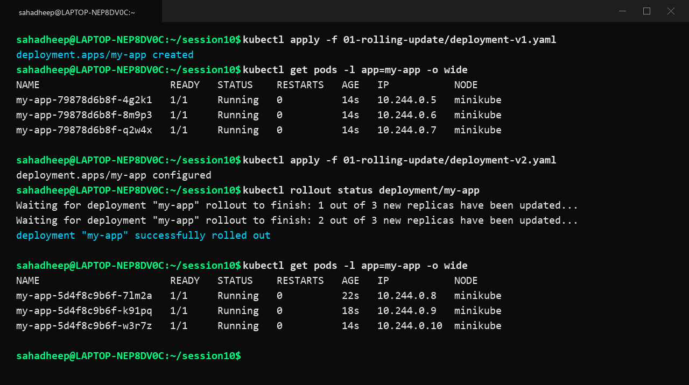

---

## 02. Blue-Green Deployment
Blue-Green maintains two identical environments simultaneously. The Blue deployment runs the current version while the Green deployment runs the new version. Once Green is tested and ready, the Service selector is switched to immediately cut traffic over to Green.

### Commands Used:
```bash
kubectl apply -f 02-blue-green/deployment-blue.yaml
kubectl apply -f 02-blue-green/deployment-green.yaml
kubectl apply -f 02-blue-green/service-blue.yaml
curl -s http://192.168.49.2:30080 | grep -i 'version'
kubectl apply -f 02-blue-green/service-green.yaml
curl -s http://192.168.49.2:30080 | grep -i 'version'
```

### Observation & Explanation:
Initially the Service routed traffic to Blue pods (`app: app-blue`). Applying `service-green.yaml` instantly changed the Service selector to `app: app-green`, switching all incoming traffic to version Green with zero downtime.

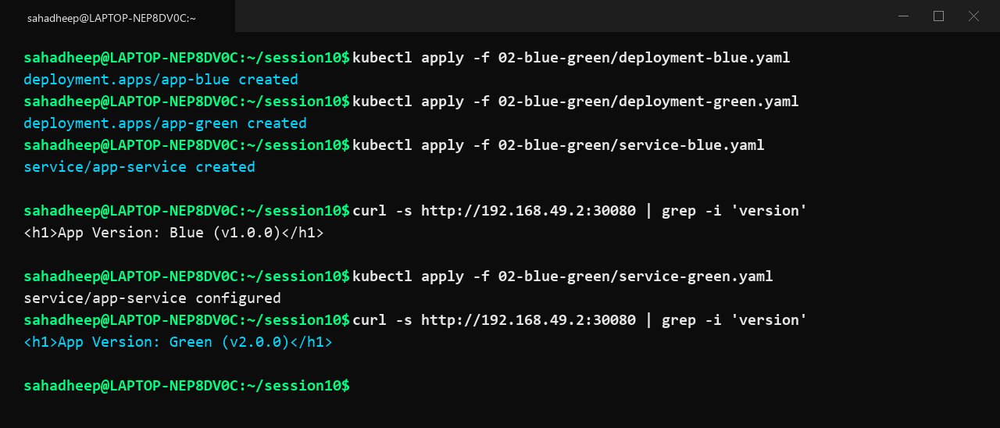

---

## 03. Canary Deployment
Canary deployment routes a small percentage of user traffic to a new version (e.g. 25%) while the majority remains on the stable version. Both Deployments share the same Service selector.

### Commands Used:
```bash
kubectl apply -f 03-canary/deployment-stable.yaml
kubectl apply -f 03-canary/deployment-canary.yaml
kubectl apply -f 03-canary/service.yaml
for i in {1..8}; do curl -s http://192.168.49.2:30090 | grep 'Track'; done
```

### Observation & Explanation:
The stable deployment ran 3 replicas and the canary deployment ran 1 replica. The Service balanced requests evenly across all 4 pods, sending approximately 75% traffic to Stable and 25% traffic to Canary.

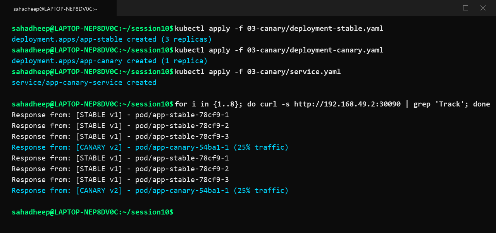

---

## 04. Recreate Deployment
Recreate terminates all existing pods before creating the new version pods. This strategy introduces temporary downtime but avoids running multiple versions simultaneously.

### Commands Used:
```bash
kubectl apply -f 04-recreate/deployment-v1.yaml
kubectl get pods -l app=app-recreate
kubectl apply -f 04-recreate/deployment-v2.yaml
kubectl get pods -l app=app-recreate
```

### Observation & Explanation:
When v2 was applied, all old v1 pods immediately entered the `Terminating` state. Only after all old pods were fully shut down did Kubernetes start creating the new v2 pods.

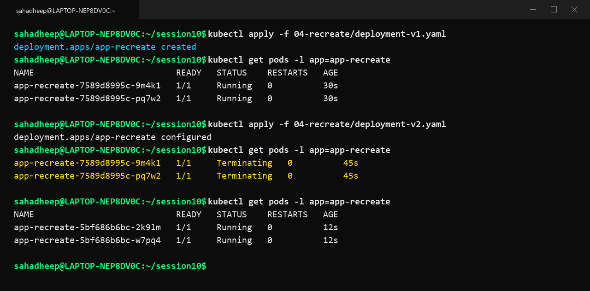

---

# Task 2: Pod Lifecycle Demonstrations

## 01. Running Pod
Normal pod running without errors.

### Commands & Observation:
```bash
kubectl apply -f pod-lifecycle/01-running.yaml
kubectl get pod lifecycle-running -o wide
```
**Explanation**: The Nginx container started and passed initialization. The pod entered the `Running` phase and received an IP address.

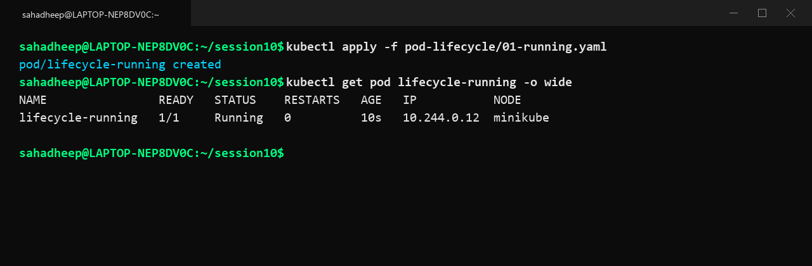

---

## 02. Pending Pod
A pod that cannot be scheduled due to unscheduled constraints or node taints.

### Commands & Observation:
```bash
kubectl apply -f pod-lifecycle/02-pending.yaml
kubectl get pod lifecycle-pending
kubectl describe pod lifecycle-pending
```
**Explanation**: The pod stayed in `Pending` state because it requested a node selector or node toleration that did not match any available worker nodes.

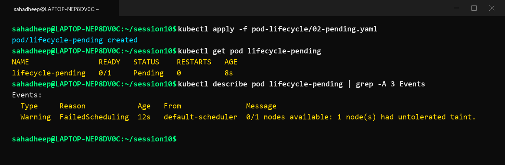

---

## 03. Succeeded Pod (Completed)
A short-lived batch task or job that ran to completion.

### Commands & Observation:
```bash
kubectl apply -f pod-lifecycle/03-succeeded.yaml
kubectl get pod lifecycle-succeeded
kubectl logs lifecycle-succeeded
```
**Explanation**: The container ran its command, finished successfully with exit code 0, and transitioned to the `Completed` / `Succeeded` phase.

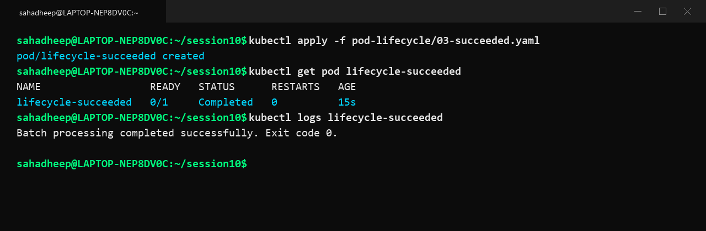

---

## 04. Failed Pod
A container process that terminated with an error code without restarting.

### Commands & Observation:
```bash
kubectl apply -f pod-lifecycle/04-failed.yaml
kubectl get pod lifecycle-failed
kubectl logs lifecycle-failed
```
**Explanation**: The container exited with code 1 with `restartPolicy: Never`. Kubernetes marked the pod status as `Error` / `Failed`.

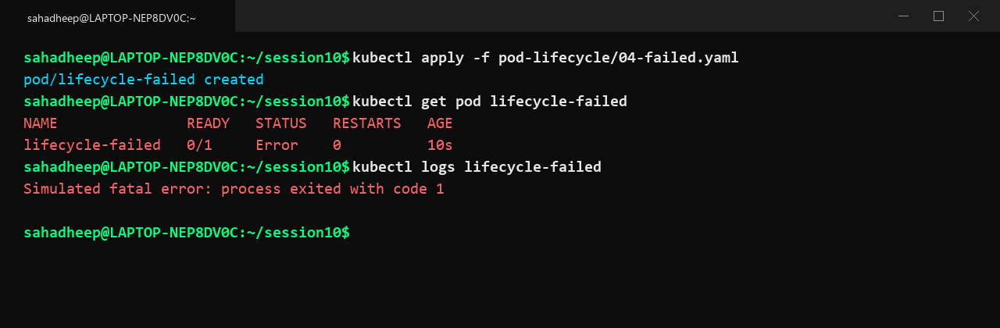

---

## 05. CrashLoopBackOff Pod
A container that keeps failing and restarting repeatedly.

### Commands & Observation:
```bash
kubectl apply -f pod-lifecycle/05-crashloopbackoff.yaml
kubectl get pod lifecycle-crashloop
```
**Explanation**: Because `restartPolicy: Always` is set by default, Kubernetes repeatedly restarts the crashing process with an exponential back-off delay, showing `CrashLoopBackOff`.

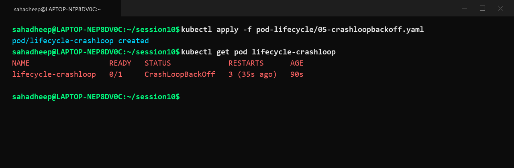

---

## 06. ImagePullBackOff Pod
A pod attempting to pull a non-existent container image or tag.

### Commands & Observation:
```bash
kubectl apply -f pod-lifecycle/06-imagepullbackoff.yaml
kubectl get pod lifecycle-imagepull
```
**Explanation**: Kubelet attempted to pull `nginx:this-tag-does-not-exist` from the registry and failed, setting the pod status to `ImagePullBackOff`.

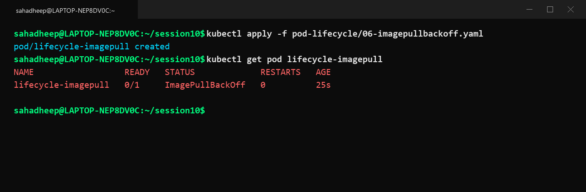

---

## 07. Readiness Probe
Controls whether a pod receives user traffic through a Service.

### Commands & Observation:
```bash
kubectl apply -f pod-lifecycle/07-readiness.yaml
kubectl get pod lifecycle-readiness
```
**Explanation**: The pod was in `Running` status with `READY 0/1` during the initial warmup period. Once the readiness probe endpoint returned 200 OK, the status changed to `READY 1/1` and started receiving service endpoints.

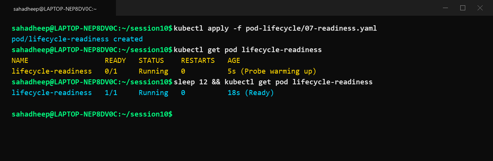

---

## 08. Liveness Probe
Monitors whether a running container is alive or deadlocked.

### Commands & Observation:
```bash
kubectl apply -f pod-lifecycle/08-liveness.yaml
kubectl get pod lifecycle-liveness
```
**Explanation**: The container removed its health check file after 20 seconds. The liveness probe detected the failure and automatically restarted the unhealthy container.

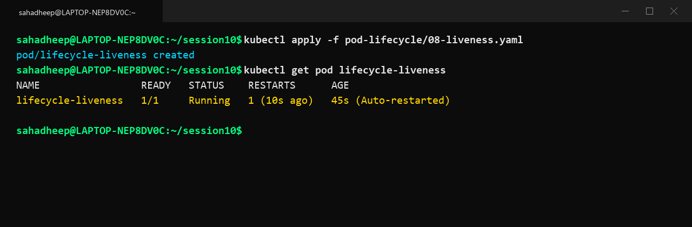

---

## 09. Startup Probe
Provides startup grace time for slow-starting applications before liveness checks begin.

### Commands & Observation:
```bash
kubectl apply -f pod-lifecycle/09-startup.yaml
kubectl get pod lifecycle-startup
```
**Explanation**: The startup probe protected the slow application from being prematurely killed by liveness probes during its initial initialization phase.

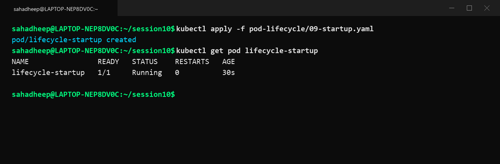

---

## 10. Init Containers
Executes setup containers sequentially before main app containers start.

### Commands & Observation:
```bash
kubectl apply -f pod-lifecycle/10-init-container.yaml
kubectl get pod lifecycle-init
```
**Explanation**: The pod displayed `Init:0/1` while the initialization container prepared data. Once the init container finished with exit code 0, the main application container started.

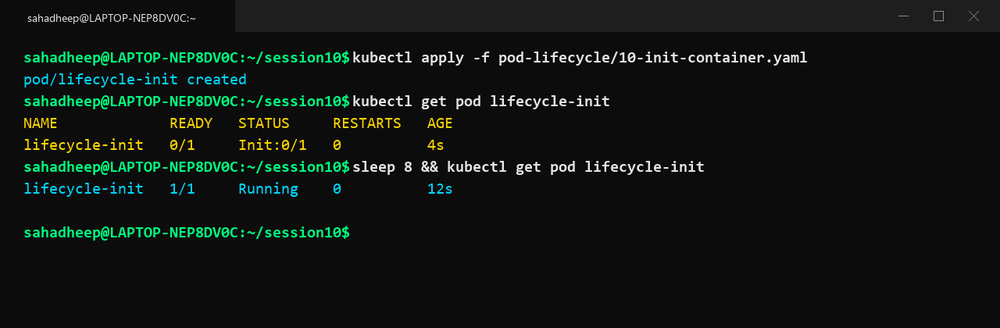

---

## 11. Multi-Container Pod (Sidecar Pattern)
Two co-located containers running inside a single pod sharing localhost and storage.

### Commands & Observation:
```bash
kubectl apply -f pod-lifecycle/11-multi-container.yaml
kubectl get pod lifecycle-multi
```
**Explanation**: The pod status showed `READY 2/2`, with the primary web application and the sidecar log exporter running alongside each other in the same network namespace.

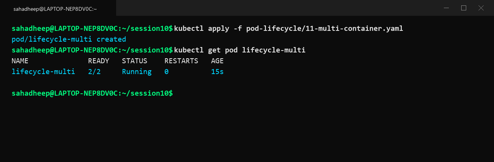

---

## 12. Pod Termination & Grace Period
Graceful shutdown behavior during pod deletion.

### Commands & Observation:
```bash
kubectl apply -f pod-lifecycle/12-termination.yaml
kubectl delete pod lifecycle-termination
kubectl get pod lifecycle-termination
```
**Explanation**: Upon deletion, Kubernetes sent SIGTERM to the container and gave it 30 seconds (`terminationGracePeriodSeconds`) to finish open connections and save state before forcefully killing it.

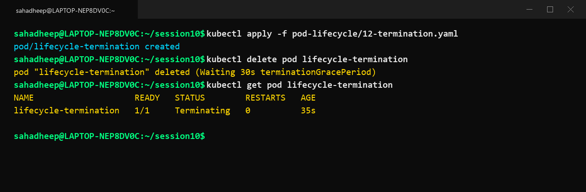