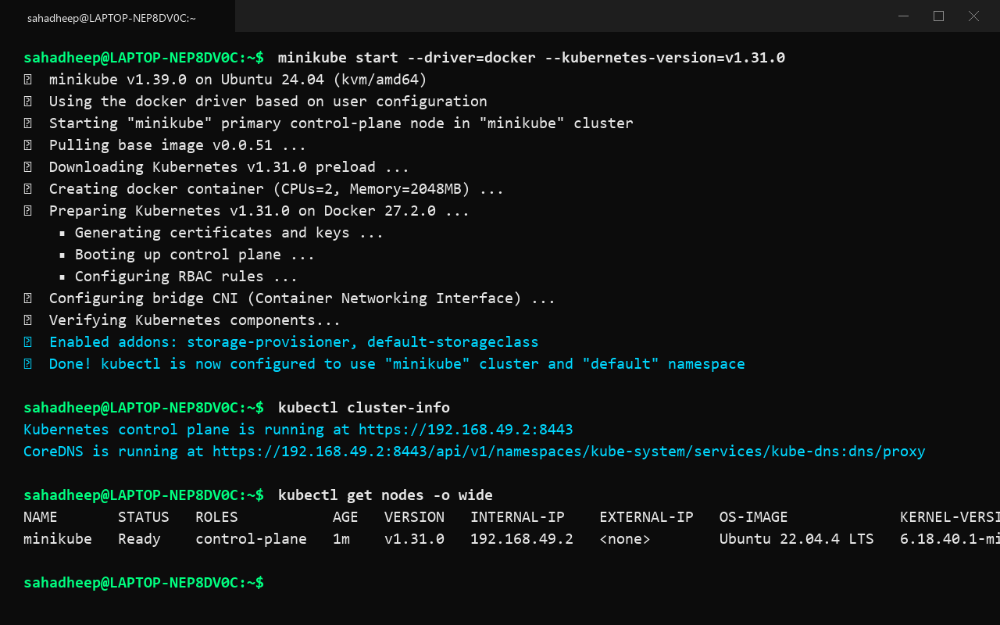
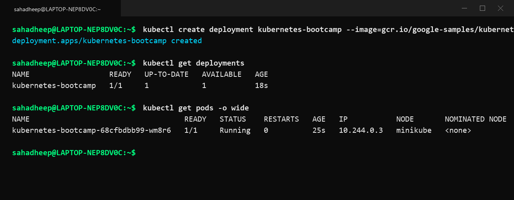
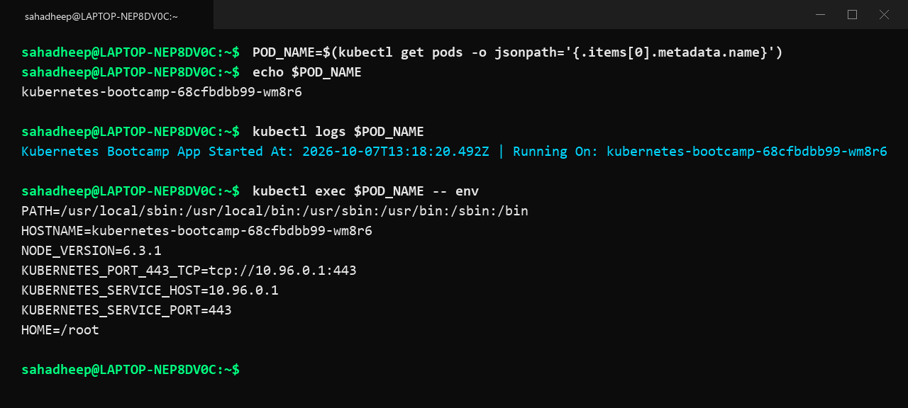
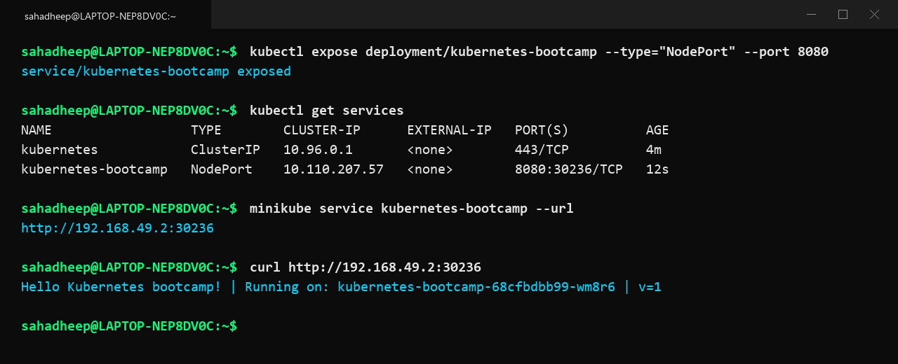
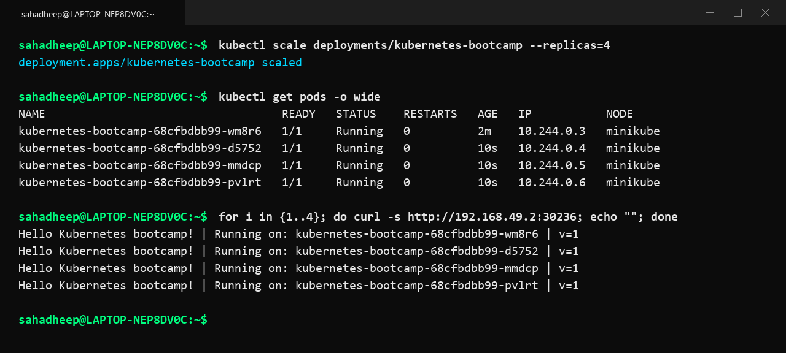
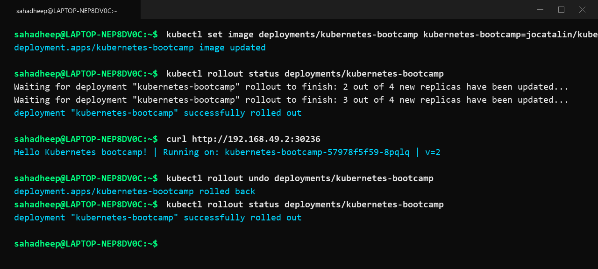

# Session 9: Kubernetes & Minikube Hands-on

## Kubernetes Architecture Notes

Kubernetes is a container orchestration tool that automates deploying, scaling, and managing containerized applications across multiple nodes.

A Kubernetes cluster has two main parts: the Control Plane (Master) and Worker Nodes.

### Master Node (Control Plane)
1. **API Server (`kube-apiserver`)**: The central communication hub. Every request from kubectl, controllers, or nodes goes through the API server via REST API.
2. **etcd**: Key-value database that stores all cluster configuration, object states, and metadata.
3. **Scheduler (`kube-scheduler`)**: Decides which worker node should run a newly created pod based on available CPU, memory, and rules.
4. **Controller Manager (`kube-controller-manager`)**: Continuously monitors the cluster state and ensures the current state matches the desired state.

### Worker Nodes
1. **kubelet**: Agent running on each node that talks to the API server and ensures containers inside pods are running properly.
2. **kube-proxy**: Handles network routing and load balances traffic to pods across nodes.
3. **Container Runtime**: The underlying engine (like containerd or docker) that pulls images and runs the containers.

### Core Kubernetes Objects
1. **Pod**: Smallest deployable unit in Kubernetes containing one or more containers sharing network IP and storage.
2. **Deployment**: Manages pod replicas, rolling updates, and rollbacks declaratively.
3. **Service**: Provides a permanent IP and port to access dynamic pods (ClusterIP, NodePort, LoadBalancer).
4. **Namespace**: Virtual cluster to separate environments like dev, test, and prod.

---

## Hands-on Commands & Output Screenshots

### 1. Start Minikube & Check Cluster Status

Run in terminal:
```bash
minikube start --driver=docker
kubectl cluster-info
kubectl get nodes -o wide
```



---

### 2. Deploy Application

Run in terminal:
```bash
kubectl create deployment kubernetes-bootcamp --image=gcr.io/google-samples/kubernetes-bootcamp:v1
kubectl get deployments
```



---

### 3. Explore Pods, Logs & Exec

Run in terminal:
```bash
kubectl get pods -o wide
kubectl describe pod <pod-name>
kubectl logs <pod-name>
kubectl exec <pod-name> -- env
```



---

### 4. Expose Application via Service

Run in terminal:
```bash
kubectl expose deployment/kubernetes-bootcamp --type="NodePort" --port 8080
kubectl get services
kubectl describe service kubernetes-bootcamp
minikube service kubernetes-bootcamp --url
curl <service-url>
```



---

### 5. Scale Application

Run in terminal:
```bash
kubectl scale deployments/kubernetes-bootcamp --replicas=4
kubectl get pods -o wide
curl <service-url>
```



---

### 6. Rolling Update & Rollback

Run in terminal:
```bash
# Rolling Update to v2
kubectl set image deployments/kubernetes-bootcamp kubernetes-bootcamp=jocatalin/kubernetes-bootcamp:v2
kubectl rollout status deployments/kubernetes-bootcamp
curl <service-url>

# Rollback
kubectl rollout undo deployments/kubernetes-bootcamp
kubectl rollout status deployments/kubernetes-bootcamp
```



---

### 7. Cleanup

```bash
kubectl delete service kubernetes-bootcamp
kubectl delete deployment kubernetes-bootcamp
minikube stop
```